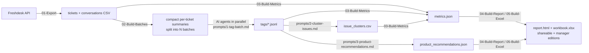

# AI-assisted Freshdesk ticket analysis

Read **every** support conversation with AI, find out what's really driving ticket volume, and publish an
interactive report plus spreadsheet. It runs on a standard Windows laptop: **only PowerShell 5.1 and Excel are needed**, no Python or Node.

> 👉 **[See the demo report](docs/demo-report.html)**. It's built entirely from synthetic data for a fictional company.

## What you get

- **Team-level metrics**: first response, resolution, first contact resolution (FCR), backlog, and time spent waiting on customers. Shown combined and per team.
- **Volume drivers**: every ticket tagged with a contact reason, a specific issue, root cause and whether it was preventable (by the product, self-service/KB, or process automation).
- **A Product team section**: recurring product problems turned into ranked, specific recommendations with example tickets.
- **Communication quality**: clarity, empathy and ownership, scored per ticket.
- **Two editions of every output**:
  - a *shareable* report and workbook with team-level figures only. Agent-level data is **removed from the file**, not just hidden.
  - a *manager-only* report and workbook with per-agent scorecards and coaching notes.

## How it works



The AI steps were run with Claude Code subagents, one per batch in parallel, but any agent setup that can read and write local files will work.
Everything else is deterministic PowerShell, so **the numbers come from Freshdesk timestamps, not from the AI**.

## Try the demo (2 minutes, no API key or AI needed)

```powershell
git clone <this repo>; cd freshdesk-ai-ticket-analysis
.\demo\Generate-DemoData.ps1 -RunDir .\demo\run          # 400 synthetic tickets + synthetic AI tags
.\scripts\03-Build-Metrics.ps1 -RunDir .\demo\run
.\scripts\04-Build-Report.ps1  -RunDir .\demo\run
start .\demo\run\output\report.html
```

If script execution is blocked, prefix each command with `powershell -ExecutionPolicy Bypass -File`.

## Run it on your own Freshdesk

1. **Configure**: copy `config.example.json` to `config.json` and set your team (group) names. Edit `taxonomy.json` and `prompts/tagging-instructions.md` to match your product.
2. **Export**: your API key is read from `$env:FRESHDESK_API_KEY`, or you're prompted for it with hidden input.
   ```powershell
   .\scripts\01-Export-FreshdeskTickets.ps1 -Domain yourcompany -Since 2026-08-01 -Groups "Customer Care,Technical Support" -OutDir .\run
   ```
   It pulls tickets, every conversation and internal note, and ticket fields, and resolves agent, group and company names. Rate limits are handled automatically.
3. **Batch**: `.\scripts\02-Build-Batches.ps1 -RunDir .\run -Batches 10`
4. **Tag with AI**: run one agent per `run\batches\batch_NN.txt` using `prompts/1-tag-batch.md`. About 200 tickets per agent works well.
5. **Optional second passes**: `prompts/2-cluster-issues.md` (strongly recommended) and `prompts/3-product-recommendations.md`.
6. **Write your narrative**: `run\narrative.json` holds the executive summary, insights, improvement cards and recognition. See `demo/narrative.json` for the format.
7. **Build**:
   ```powershell
   .\scripts\03-Build-Metrics.ps1 -RunDir .\run
   .\scripts\04-Build-Report.ps1  -RunDir .\run
   .\scripts\05-Build-Excel.ps1   -RunDir .\run -Shareable ; .\scripts\05-Build-Excel.ps1 -RunDir .\run
   ```

## Metric definitions (all configurable in `config.json`)

| Metric | Definition |
|---|---|
| First response | Ticket creation to first agent reply, in **weekday hours** (Saturday/Sunday excluded). The calendar-hours figure is also computed. |
| Resolution | Creation to resolution. It's reported **with and without** tickets closed after the customer stopped responding to follow-ups. |
| FCR | Resolved tickets closed with **≤ 2 customer replies** after the original request. |
| Time waiting on customer | Each ticket's open time, split by who spoke last: agent (waiting on customer) or customer (waiting on the team). |
| Ended positive or neutral | AI-judged customer tone at the end of the thread, counting only tickets where the customer wrote back. |
| Noise | Spam, auto-replies, bounces and test tickets. Counted, but excluded from speed and quality metrics. |

## Lessons learned

See **[docs/lessons-learned.md](docs/lessons-learned.md)**. It covers what surprised us, the metric traps, and how to present AI analysis of your own team responsibly.

## Privacy

- Never commit real exports. `.gitignore` excludes `run/`, `*.csv`, `*.jsonl` and `config.json` by default.
- Conversations contain customer personal data. Check your company's AI and data policy before sending ticket text to any model.
- The shareable editions strip agent-level data, but ticket subjects can still contain customer names. Review before distributing.

## Limitations

- AI tags are consistent enough for totals and trends, but individual tags are indicative only.
- Quality scores tend to cluster in the 3–4 range, so compare agents within their own team, over enough tickets.
- Built and tested on Windows PowerShell 5.1 with Freshdesk API v2.
